# 数字系统设计作业报告

&nbsp;

##### 姓名：肖佳伟
##### 学号：515030910023

&nbsp;

## 2-1

#### 2-1.1 代码：

###### `wavegen` 模块

```verilog
// File: wavegen.v

`timescale 10 ns / 1 ns

module wavegen;

    reg clk;

    initial begin
        clk = 1'b0;
        #2 clk = 1'b1;
        #1 clk = 1'b0;
        #9 clk = 1'b1;
        #10 clk = 1'b0;
        #2 clk = 1'b1;
        #3 clk = 1'b0;
        #5 clk = 1'b1;
    end

endmodule
```

#### 2-1.2 仿真：

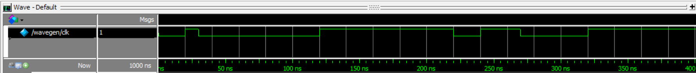

&nbsp;

## 2-2

#### 2-2.1 代码：

###### `Encoder8x3` 模块

```verilog
// File: encoder8x3.v

module Encoder8x3(code, data);

    output reg [2:0] code;
    input [7:0] data;

    always @ ( data ) begin
        case (data)
            8'b0000_0001: code <= 3'd0;
            8'b0000_0010: code <= 3'd1;
            8'b0000_0100: code <= 3'd2;
            8'b0000_1000: code <= 3'd3;
            8'b0001_0000: code <= 3'd4;
            8'b0010_0000: code <= 3'd5;
            8'b0100_0000: code <= 3'd6;
            8'b1000_0000: code <= 3'd7;
        endcase
    end

endmodule
```

&nbsp;

###### `tb_encoder8x3` 测试台模块

```verilog
// File: tb_encoder8x3.v

`include "encoder8x3.v"

module tb_encoder8x3;

    parameter STEP = 8;

    wire [2:0] code;
    reg [7:0] data;
    integer k;

    Encoder8x3 a(code, data);

    initial begin
        data = 8'b0000_0001;
        for ( k=1; k<STEP; k=k+1 )
            #1 data = data << 1;
    end

    initial begin
        $monitor("At time %4t, data=%b, code=%d",
                    $time, data, code);
    end

endmodule
```

#### 2-2.2 仿真：

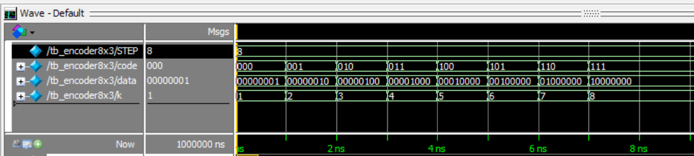

&nbsp;

## 2-3

#### 2-3.1 代码：

###### `mux2x1` 模块

```verilog
// File: mux2x1.v

module mux2x1(dout, sel, din);

    output dout;
    input sel;
    input [1:0] din;

    bufif0 (dout, din[0], sel);
    bufif1 (dout, din[1], sel);

endmodule
```

&nbsp;

###### `mux4x1` 模块

```verilog
// File: mux4x1.v

`include "mux2x1.v"

module mux4x1(dout, sel, din);

    output dout;
    input [1:0] sel;
    input [3:0] din;

    wire ta, tb;

    mux2x1 a(ta, sel[0], din[1:0]),
           b(tb, sel[0], din[3:1]),
           c(dout, sel[1], {ta, tb});

endmodule
```

&nbsp;

###### `tb_mux2x1` 测试台模块

```verilog
// File: tb_mux2x1.v

`include "mux2x1.v"

module tb_mux2x1;

    parameter STEP = 2;
    integer k;

    wire dout;
    reg [1:0] din;
    reg sel;

    mux2x1 a(dout, sel, din);

    initial begin
        sel = 1'b0;
        for ( k=1; k<STEP; k=k+1 )
            #1 sel = sel + 1'b1;
    end

    initial begin
        din = 2'b01;
    end

    initial begin
        $monitor("At time %4t, din=%b, sel=%b, dout=%b",
                    $time, din, sel, dout);
    end

endmodule
```

&nbsp;

###### `tb_mux4x1` 测试台模块

```verilog
// File: tb_mux4x1.v

`include "mux4x1.v"

module tb_mux4x1;

    parameter STEP = 4;
    integer k;

    wire dout;
    reg [1:0] sel;
    reg [3:0] din;

    mux4x1 a(dout, sel, din);

    initial begin
        sel = 2'b00;
        for ( k=1; k<STEP; k=k+1 )
            #1 sel = sel + 1;
    end

    initial begin
        din = 4'b0001;
        for ( k=1; k<STEP; k=k+1 )
            #5 din = din << 1;
    end

    initial begin
        $monitor("At time %4t, din=%b, sel=%b, dout=%b",
                    $time, din, sel, dout);
    end

endmodule
```

#### 2-3.2 仿真：

###### `mux2x1` 模块


###### `mux4x1` 模块


&nbsp;

## 2-4

#### 2-4.1 代码：

###### `comb_str` 模块

```verilog
// File: comb_str.v

module comb_str(Y, A, B, C, D);

    output Y;
    input A, B, C, D;

    wire U1, U2, U3, U4, U5;

    or (U3, A, D);
    not (U2, U3),
        (U1, D);
    and (U4, B, C, U1),
        (U5, U2, U4);
    buf (Y, U5);

endmodule
```

&nbsp;

###### `comb_dataflow` 模块

```verilog
// File: comb_dataflow.v

module comb_dataflow(Y, A, B, C, D);

    output Y;
    input A, B, C, D;

    assign Y = ~(A | D) & (B & C & ~D);

endmodule
```

&nbsp;

###### `comb_behaviour` 模块

```verilog
// File: comb_behaviour.v

module comb_behaviour(Y, A, B, C, D);

    output reg Y;
    input A, B, C, D;

    always @ ( * ) begin
        Y = ~(A | D) & (B & C & ~D);
    end

endmodule
```

&nbsp;

###### `comb_prim` 模块

```verilog
// File: comb_prim.v

primitive comb_prim(Y, A, B, C, D);

    output Y;
    input A, B, C, D;

    table
    //  A  B  C  D : Y ;
        0  0  ?  ? : 0 ;
        0  1  0  ? : 0 ;
        0  1  1  0 : 1 ;
        0  1  1  1 : 0 ;
        1  ?  ?  ? : 0 ;
    endtable

endprimitive
```

&nbsp;

###### `testbech_comb` 测试台模块

```verilog
// File: testbech_comb.v

`include "comb_str.v"
`include "comb_dataflow.v"
`include "comb_behaviour.v"
`include "comb_prim.v"

module testbech_comb;

    parameter STEP = 16;
    integer k;

    wire Y1, Y2, Y3, Y4;
    reg A, B, C, D;

    comb_str a(Y1, A, B, C, D);
    comb_dataflow b(Y2, A, B, C, D);
    comb_behaviour c(Y3, A, B, C, D);
    comb_prim d(Y4, A, B, C, D);

    initial begin
        {A, B, C, D} = 4'b0;
        for ( k=1; k<STEP; k=k+1 )
            #1 {A, B, C, D} = {A, B, C, D} + 1'b1;
    end

    initial begin
        $monitor("At time %4t, A=%b, B=%b, C=%b, D=%b, Y1=%b, Y2=%b, Y3=%b, Y4=%b",
                    $time, A, B, C, D, Y1, Y2, Y3, Y4);
    end

endmodule
```

#### 2-4.2 仿真：

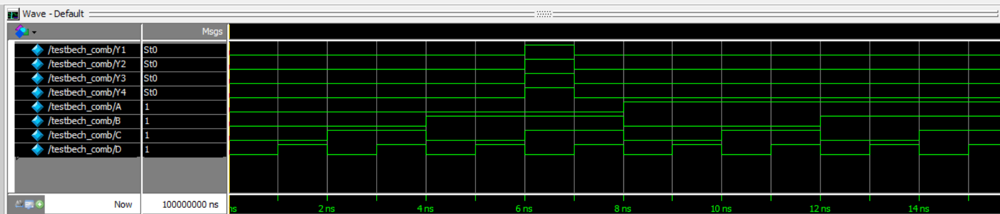


&nbsp;

## 2-5

#### 2-5.1 代码：

###### `comb_Y1` 模块

```verilog
// File: comb_Y1.v

module comb_Y1(Y, A, B, C);

    output Y;
    input A, B, C;

    assign Y = (~A & ~B & C) | (~A & B & ~C) |
                (A & ~B & ~C) | (A & ~B & C);

endmodule
```

&nbsp;

###### `comb_Y2` 模块

```verilog
// File: comb_Y2.v

module comb_Y2(Y, A, B, C, D);

    output Y;
    input A, B, C, D;

    assign Y = (~A & B & ~C & ~D) | (~A & B & ~C & D) |
                (~A & B & C & ~D) | (~A & B & C & D) |
                (A & ~B & C & D) | (A & B & ~C & ~D) |
                (A & B & ~C & D);

endmodule
```

&nbsp;

###### `tb_comb_Y1` 测试台模块

```verilog
// File: tb_comb_Y1.v

`include "comb_Y1.v"

module tb_comb_Y1;

    parameter STEP = 8;
    integer k;

    wire Y;
    reg A, B, C;

    comb_Y1 a(Y, A, B, C);

    initial begin
        {A, B, C} = 3'b0;
        for ( k=1; k<STEP; k=k+1 )
            #1 {A, B, C} = {A, B, C} + 1'b1;
    end

    initial begin
        $monitor("At time %4t, A=%b, B=%b, C=%b, Y=%b",
                    $time, A, B, C, Y);
    end

endmodule
```

&nbsp;

###### `tb_comb_Y2` 测试台模块

```verilog
// File: tb_comb_Y2.v

`include "comb_Y2.v"

module tb_comb_Y2;

    parameter STEP = 16;
    integer k;

    wire Y;
    reg A, B, C, D;

    comb_Y2 a(Y, A, B, C, D);

    initial begin
        {A, B, C, D} = 4'b0;
        for ( k=1; k<STEP; k=k+1 )
            #1 {A, B, C, D} = {A, B, C, D} + 1'b1;
    end

    initial begin
        $monitor("At time %4t, A=%b, B=%b, C=%b, D=%b, Y=%b",
                    $time, A, B, C, D, Y);
    end

endmodule
```

#### 2-5.2 仿真：

###### `comb_Y1` 模块


###### `comb_Y2` 模块


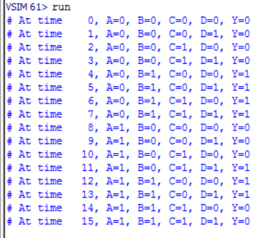

&nbsp;

## 2-6

#### 2-6.1 代码：

###### `ones_count` 模块

```verilog
// File: ones_count.v

module ones_count(count, dat_in);

    output reg [3:0] count;
    input [7:0] dat_in;

    parameter STEP = 8;
    integer k;

    always @ ( dat_in ) begin
        count = 4'b0;
        for ( k=0; k<STEP; k=k+1 )
            count = count + dat_in[k];
    end

endmodule
```

&nbsp;

###### `tb_ones_count` 测试台模块

```verilog
// File: tb_ones_count.v

`include "ones_count.v"

module tb_ones_count;

    parameter STEP = 256;
    integer k;

    wire [3:0] count;
    reg [7:0] dat_in;

    ones_count a(count, dat_in);

    initial begin
        dat_in = 8'b0;
        for ( k=1; k<STEP; k=k+1 )
            #1 dat_in = dat_in + 1'b1;
    end

    initial begin
        $monitor("At time %4t, dat_in=%b, count=%b",
                    $time, dat_in, count);
    end

endmodule
```

#### 2-6.2 仿真：

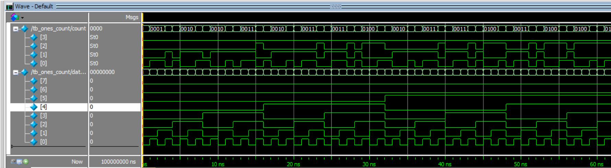


&nbsp;

## 2-7

#### 2-7.1 代码：

###### `dec_counter` 模块

```verilog
// File: dec_counter.v

module dec_counter(count, clk, reset);

    output reg [3:0] count;
    input clk, reset;

    always @ ( posedge clk ) begin
        if (reset) count <= 4'd0;
        else begin
            case (count)
                4'd0: count <= 4'd1;
                4'd1: count <= 4'd2;
                4'd2: count <= 4'd3;
                4'd3: count <= 4'd4;
                4'd4: count <= 4'd5;
                4'd5: count <= 4'd6;
                4'd6: count <= 4'd7;
                4'd7: count <= 4'd8;
                4'd8: count <= 4'd9;
                4'd9: count <= 4'd10;
                4'd10: count <= 4'd0;
                default: count <= 4'b0;
            endcase
        end
    end

endmodule
```

&nbsp;

###### `tb_dec_counter` 测试台模块

```verilog
// File: tb_dec_counter.v

`include "dec_counter.v"

module tb_dec_counter;

    wire [3:0] count;
    reg clk, reset;

    dec_counter a(count, clk, reset);

    initial begin
        clk = 1'b0;
        forever #20 clk = ~clk;
    end

    initial begin
        reset = 1'b1;
        #10 reset = 1'b0;
    end

    initial begin
        $monitor("At time %4t, reset=%b, count=%d",
                    $time, reset, count);
    end

endmodule
```

#### 2-7.2 仿真：

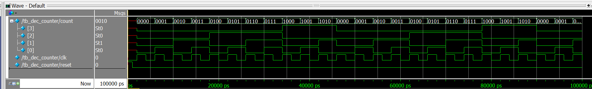

&nbsp;

## 2-8

#### 2-8.1 代码：

###### `comb_str` 模块

```verilog
// File: comb_str.v

module comb_str(y, sel, A, B, C, D);

    output y;
    input sel, A, B, C, D;

    wire U1, U2;

    nand #(3) a(U1, A, B);
    nand #(4) b(U2, C, D);
    bufif0 c(y, U1, sel);
    bufif1 d(y, U2, sel);

endmodule
```

&nbsp;

###### `tb_comb_str` 测试台模块

```verilog
// File: tb_comb_str.v

`include "comb_str.v"

module tb_comb_str;

    parameter STEP = 256;
    integer k;

    wire y;
    reg  sel, A, B, C, D;

    comb_str a(y, A, B, C, D);

    initial begin
        sel = 1'b0;
        forever #1 sel = ~sel;
    end

    initial begin
        {A, B, C, D} = 4'b0;
        for ( k=1; k<STEP; k=k+1 )
            #1 {A, B, C, D} = {A, B, C, D} + 1'b1;
    end

    initial begin
        $monitor("At time %4t, sel=%b, A=%b, B=%b, C=%b, D=%b, y=%b",
                    $time, sel, A, B, C, D, y);
    end

endmodule
```

#### 2-8.2 仿真：


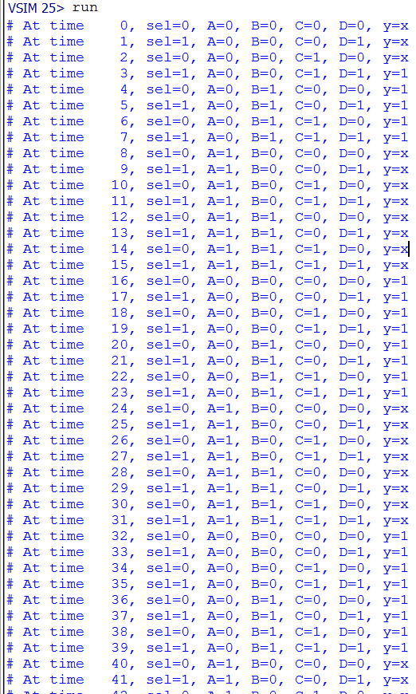

&nbsp;

## 2-9

#### 2-9.1 代码：

###### `LFSR` 模块

```verilog
// File: LFSR.v

module LFSR(q, clk, rst_n, load, din);

    output reg [1:26] q;    // 26 bit data output.
    input clk;              // Clock input.
    input rst_n;            // Synchronous reset input.
    input load;             // Synchronous load input.
    input [1:26] din;       // 26 bit parallel data input.

    always @ ( posedge clk ) begin
        if (!rst_n) q <= 26'b0;
        else begin
            if (load) q <= |din ? din : 26'b1;
            else begin
                if (q == 26'b0) q <= 26'b1;
                else begin
                    q[10:26] <= q[9:25];
                    q[9] <= q[8] ^ q[26];
                    q[8] <= q[7] ^ q[26];
                    q[3:7] <= q[2:6];
                    q[2] <= q[1] ^ q[26];
                    q[1] <= q[26];
                end
            end
        end
    end

endmodule
```

&nbsp;

###### `tb_LFSR` 测试台模块

```verilog
// File: tb_LFSR.v

`include "LFSR.v"

module tb_LFSR;

    parameter STEP = 4;

    wire [1:26] q;
    reg [1:26] din;
    reg clk, rst_n, load;

    LFSR a(q, clk, rst_n, load, din);

    initial begin
        clk = 1'b0;
        forever #20 clk = ~clk;
    end

    initial begin
        rst_n = 1'b0;
        #10 rst_n = 1'b1;
    end

    initial begin
        load = 1'b0;
        din = 26'b1_1010;
        #100 load = 1'b1;
        #100 load = 1'b0;
    end

    initial begin
        $monitor("At time %4t, rst_n=%b, load=%b, q=%d",
                    $time, rst_n, load, q);
    end

endmodule
```

#### 2-9.2 仿真：

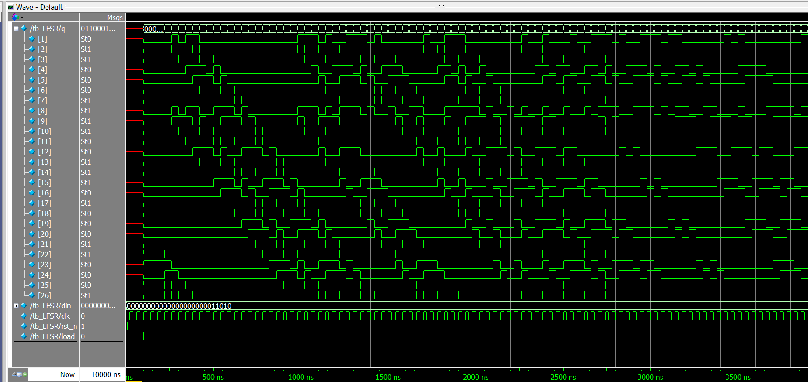

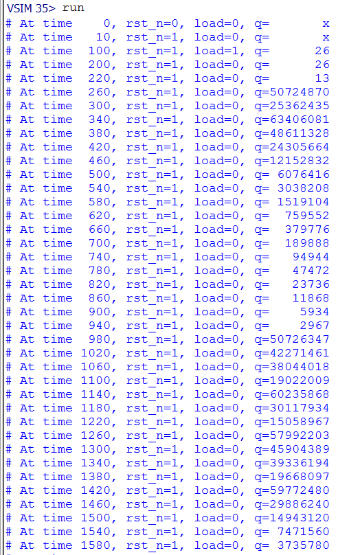

&nbsp;

## 2-10

#### 2-10.1 代码：

###### `filter` 模块

```verilog
// File: filter.v

module filter(sig_out, clock, reset, sig_in);

    output reg sig_out;
    input clock, reset, sig_in;

    wire J, K;
    reg [1:4] D;

    assign J = &D[2:4];
    assign K = &(~D[2:4]);

    always @ ( posedge clock ) begin
        if (!reset) D <= 4'b0;
        else begin
            D[1:4] <= {sig_in, D[1:3]};
        end
    end

    always @ ( posedge clock ) begin
        if (!reset) sig_out <= 1'b0;
        else begin
            case ({J, K})
                2'b00: sig_out <= sig_out;
                2'b01: sig_out <= 1'b0;
                2'b10: sig_out <= 1'b1;
                2'b11: sig_out <= ~sig_out;
                default: sig_out <= 1'bx;
            endcase
        end
    end

endmodule
```

&nbsp;

###### `tb_filter` 测试台模块

```verilog
// File: tb_filter.v

`include "filter.v"

module tb_filter;

    wire sig_out;
    reg clock, reset, sig_in;

    filter a(sig_out, clock, reset, sig_in);

    initial begin
        clock = 1'b0;
        forever #10 clock = ~clock;
    end

    initial begin
        reset = 1'b1;
        #100 reset = 1'b0;
        #100 reset = 1'b1;
    end

    initial begin
        sig_in = 1'b1;
        forever #10 sig_in = $random % 2;
    end

endmodule
```

#### 2-10.2 仿真：

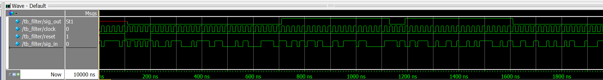

&nbsp;

## 2-11

#### 2-11.1 代码：

###### `counter8b_updown` 模块

```verilog
// File: counter8b_updown.v

module counter8b_updown(count, clk, reset, dir);

    output reg [8:0] count;
    input clk, reset, dir;

    always @ ( negedge reset ) begin
        count <= 8'b0;
    end

    always @ ( posedge clk ) begin
        case (dir)
            1'b1: count <= count + 8'b1;
            1'b0: count <= count - 8'b1;
            default: count <= 8'b0;
        endcase
    end

endmodule
```

&nbsp;

###### `tb_counter8b_updown` 测试台模块

```verilog
// File: tb_counter8b_updown.v

`include "counter8b_updown.v"

module tb_counter8b_updown;

    wire [8:0] count;
    reg clk, reset, dir;

    counter8b_updown a(count, clk, reset, dir);

    initial begin
        clk = 1'b0;
        forever #10 clk = ~clk;
    end

    initial begin
        reset = 1'b1;
        #100 reset = 1'b0;
        #100 reset = 1'b1;
    end

    initial begin
        dir = 1'b1;
        #10 dir = 1'b0;
        #1000 dir = 1'b1;
    end

endmodule
```

#### 2-11.2 仿真：

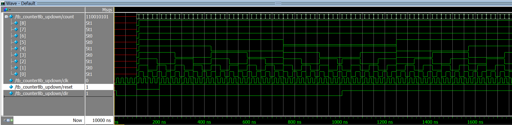

&nbsp;

## 2-12

#### 2-12.1 代码：

###### `ALU` 模块

```verilog
// File: ALU.v

module ALU(c_out, sum, oper, a, b, c_in);

    output reg [8:1] sum;
    output reg c_out;
    input [0:2] oper;
    input [8:1] a;
    input [8:1] b;
    input c_in;

    always @ ( * ) begin
        case (oper)
            3'b000: {c_out, sum} <= a + b + c_in;   // and
            3'b001: {c_out, sum} <= a + ~b + c_in;  // subtract
            3'b010: {c_out, sum} <= ~a + b + ~c_in; // subtract_a
            3'b011: {c_out, sum} <= {1'b0, a | b};  // or_ab
            3'b100: {c_out, sum} <= {1'b0, a & b};  // and_ab
            3'b101: {c_out, sum} <= {1'b0, ~a & b}; // not_ab
            3'b110: {c_out, sum} <= {1'b0, a ^ b};  // exor
            3'b111: {c_out, sum} <= {1'b0, a ~^ b}; // exnor
            default: {c_out, sum} <= 9'bx;
        endcase
    end

endmodule
```

&nbsp;

###### `tb_ALU` 测试台模块

```verilog
// File: tb_ALU.v

`include "ALU.v"

module tb_ALU;

    parameter STEP = 8;
    integer k;

    wire c_out, sum;
    reg [0:2] oper;
    reg [8:1] a;
    reg [8:1] b;
    reg c_in;

    ALU c(c_out, sum, oper, a, b, c_in);

    initial begin
        oper = 3'b0;
        for ( k=1; k<STEP; k=k+1 )
            #5 oper = oper + 3'b1;
    end

    initial begin
        a = 8'b0;
        forever #5 a = {a[8:1], $random % 2};
    end

    initial begin
        b = 8'b0;
        forever #10 b = {b[8:1], $random % 2};
    end

    initial begin
        c_in = 1'b0;
        forever #15 c_in = $random % 2;
    end

    initial begin
        $monitor("At time %4t, a=%b, b=%b, c_in=%b, oper=%b, sum=%b, c_out=%b",
                    $time, a, b, c_in, oper, sum, c_out);
    end

endmodule
```

#### 2-12.2 仿真：

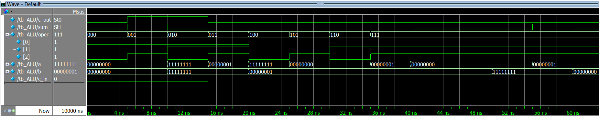

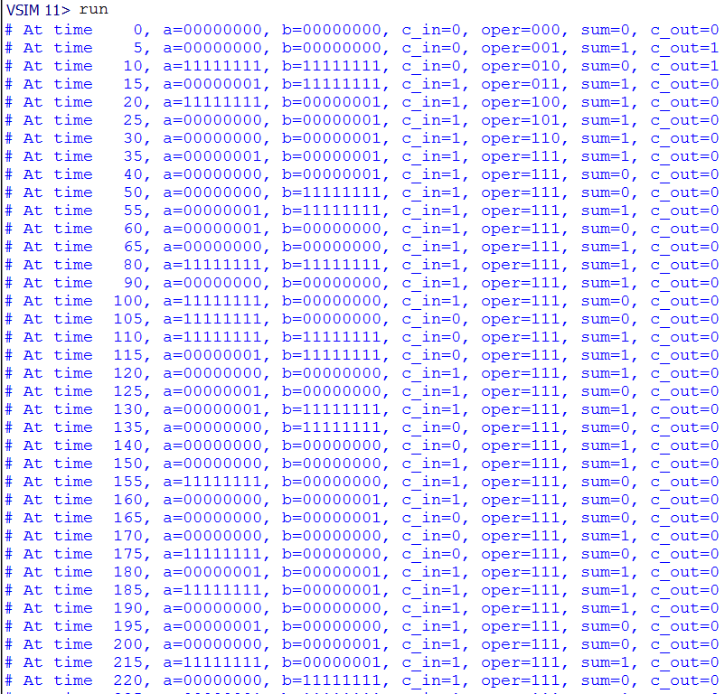

&nbsp;

## 2-13

#### 2-13.1 代码：

###### `shift_counter` 模块

```verilog
// File: shift_counter.v

module shift_counter(count, clk, reset);

    output reg [7:0] count;
    input clk, reset;

    reg dir;
    reg [1:0] cnt;

    initial begin
        dir <= 1'b1;
        cnt <= 2'b0;
        count <= 8'b1;
    end

    always @ ( posedge clk ) begin
        if (reset) begin
            dir <= 1'b1;
            cnt <= 2'b0;
            count <= 8'b1;
        end else begin
            if (!dir) count <= count >> 1;
            else begin
                if (cnt == 2'b11) count <= count << 1;
                else begin
                    count <= count;
                    cnt <= cnt + 1;
                end
            end
        end
    end

    always @ ( posedge count[0] ) begin
        dir <= 1'b1;
    end

    always @ ( posedge count[7] ) begin
        dir <= 1'b0;
        cnt <= 2'b0;
    end

endmodule
```

&nbsp;

###### `tb_shift_counter` 测试台模块

```verilog
// File: tb_shift_counter.v

`include "shift_counter.v"

module tb_shift_counter;

    wire [7:0] count;
    reg clk, reset;

    shift_counter a(count, clk, reset);

    initial begin
        clk = 1'b0;
        forever #10 clk = ~clk;
    end

    initial begin
        reset = 1'b0;
        #100 reset = 1'b1;
        #100 reset = 1'b0;
    end

    initial begin
        $monitor("At time %4t, reset=%b, count=%b",
                    $time, reset, count);
    end

endmodule
```

#### 2-13.2 仿真：


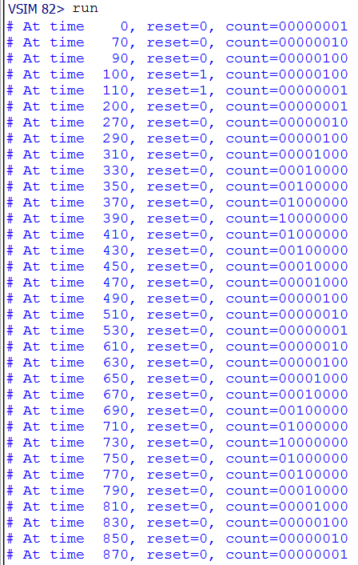

&nbsp;

## 2-14

#### 2-14.1 代码：

###### `sram` 模块

```verilog
// File: sram.v

module sram(dout, din, addr, wr, rd, cs);

    output [7:0] dout;
    input [7:0] din;
    input [7:0] addr;
    input wr, rd, cs;

    reg [7:0] sram [255:0];
    reg [7:0] data;

    assign dout = (cs && !rd) ? data : 8'bz;

    always @ ( posedge wr ) begin
        if (cs) sram[addr] <= din;
    end

    always @ ( negedge rd ) begin
        if (cs) data <= sram[addr];
    end

endmodule
```

&nbsp;

###### `tb_sram` 测试台模块

```verilog
// File: tb_sram.v

`include "sram.v"

module tb_sram;

    wire [7:0] dout;
    reg [7:0] din;
    reg [7:0] addr;
    reg wr, rd, cs;

    sram a(dout, din, addr, wr, rd, cs);

    initial begin
        cs = 1'b0;
        #10 cs = 1'b1;
        #10 cs = 1'b0;
        #10 cs = 1'b1;
    end

    initial begin
        din = 8'b1010_0101;
        addr = 8'b0101_1010;
        #100 addr = 8'b1010_0101;
    end

    initial begin
        wr = 1'b0;
        rd = 1'b1;
        forever begin
            #10;
            wr = $random % 2;
            rd = $random % 2;
        end
    end

    initial begin
        $monitor("At time %4t, din=%b, addr=%b, cs=%b, wr=%b, rd=%b, dout=%b",
                    $time, din, addr, cs, wr, rd, dout);
    end

endmodule
```

#### 2-14.2 仿真：

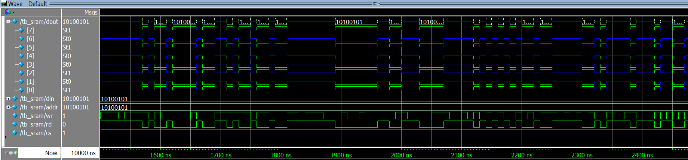

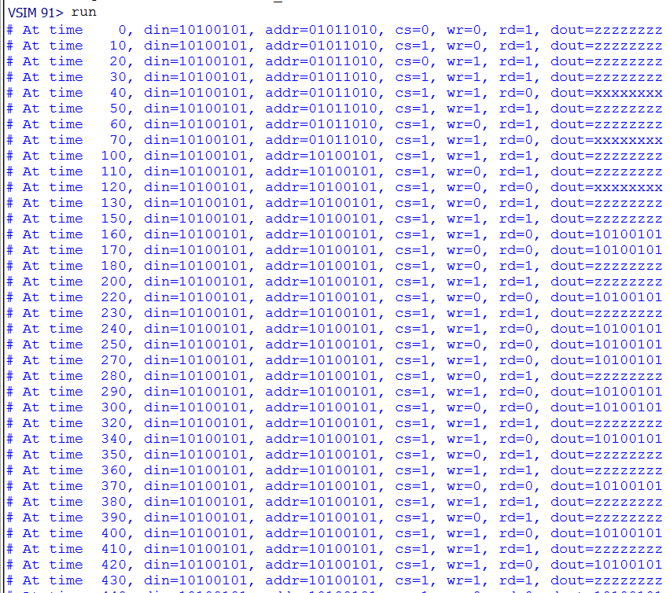

&nbsp;

## 2-15

#### 2-15.1 代码：

###### `seq_detect` 模块

```verilog
// File: seq_detect.v

module seq_detect(flag, din, clk, rst_n);

    output reg flag;
    input din, clk, rst_n;

    parameter S10 = 9'b0_0000_0001; // IDLE(0)
    parameter S11 = 9'b0_0000_0010; // A(0)
    parameter S12 = 9'b0_0000_0100; // B(0)
    parameter S13 = 9'b0_0000_1000; // C(0)
    parameter S14 = 9'b0_0001_0000; // D(1)

    parameter S20 = 9'b0_0000_0001; // IDLE(0)
    parameter S21 = 9'b0_0010_0000; // E(0)
    parameter S22 = 9'b0_0100_0000; // F(0)
    parameter S23 = 9'b0_1000_0000; // G(0)
    parameter S24 = 9'b1_0000_0000; // H(1)

    reg [8:0] state1;   // 1101
    reg [8:0] state2;   // 0110
    reg flag1, flag2;

    always @ ( * ) begin
        flag <= flag1 | flag2;
    end

    always @ ( negedge clk ) begin
        if (!rst_n) begin
            flag1 <= 1'b0;
            state1 <= S10;
        end else begin
            flag1 <= (state1 == S14) ? 1'b1 : 1'b0;
            case (state1)
                S10: state1 <= (din) ? S11 : S10;
                S11: state1 <= (din) ? S12 : S10;
                S12: state1 <= (din) ? S12 : S13;
                S13: state1 <= (din) ? S14 : S10;
                S14: state1 <= (din) ? S12 : S10;
                default: begin state1 <= S10; flag1 <= 1'b0; end
            endcase
        end
    end

    always @ ( negedge clk ) begin
        if (!rst_n) begin
            flag2 <= 1'b0;
            state2 <= S20;
        end else begin
            flag2 <= (state2 == S24) ? 1'b1 : 1'b0;
            case (state2)
                S20: state2 <= (din) ? S20 : S21;
                S21: state2 <= (din) ? S22 : S21;
                S22: state2 <= (din) ? S23 : S21;
                S23: state2 <= (din) ? S20 : S24;
                S24: state2 <= (din) ? S22 : S21;
                default: begin state2 <= S20; flag2 <= 1'b0; end
            endcase
        end
    end

endmodule
```

&nbsp;

###### `tb_seq_detect` 测试台模块

```verilog
// File: tb_seq_detect.v

`include "seq_detect.v"

module tb_seq_detect;

    parameter STEP = 32;
    integer k;

    wire flag;
    reg [31:0] data;
    reg din,clk, rst_n;

    seq_detect a(flag, din, clk, rst_n);

    initial begin
        clk = 1'b0;
        forever #10 clk = ~clk;
    end

    initial begin
        rst_n = 1'b0;
        #50 rst_n = 1'b1;
    end

    initial begin
        data = 32'b1100_0110_0100_0110_1010_0100_1010_0010;
        for ( k=1; k<STEP; k=k+1 ) begin
            #20;
            din = data[31];
            data = data << 1;
        end
    end

endmodule
```

#### 2-15.2 仿真：


#### 2-15.3 图示：

###### `seq_detect` 模块

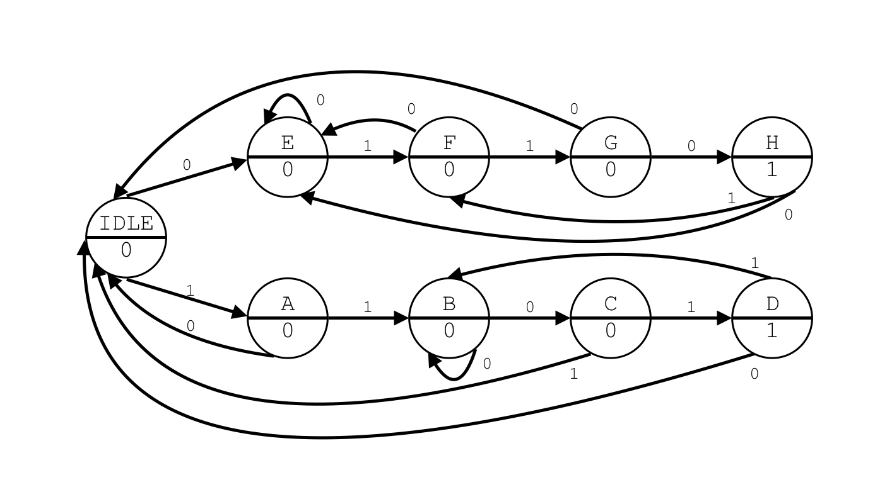

&nbsp;

## 2-16

#### 2-16.1 代码：

###### `mealy` 模块

```verilog
// File: mealy.v

module mealy(flag, din, clk, rst);

    output reg flag;
    input din, clk, rst;

    parameter S0 = 8'b0000_0001;  // IDLE(0)
    parameter S1 = 8'b0000_0010;  // A(0)
    parameter S2 = 8'b0000_0100;  // B(0)
    parameter S3 = 8'b0000_1000;  // C(0)
    parameter S4 = 8'b0001_0000;  // D(0)
    parameter S5 = 8'b0010_0000;  // E(0)
    parameter S6 = 8'b0100_0000;  // F(0)
    parameter S7 = 8'b1000_0000;  // G(0)

    reg [8:0] state;

    always @ ( posedge rst ) begin
        flag <= 1'b0;
        state <= S0;
    end

    always @ ( posedge clk ) begin
        case (state)
            S0: if (din) begin state <= S0; flag <= 1'b0; end
                else begin state <= S1; flag <= 1'b0; end
            S1: if (din) begin state <= S2; flag <= 1'b0; end
                else begin state <= S1; flag <= 1'b0; end
            S2: if (din) begin state <= S0; flag <= 1'b0; end
                else begin state <= S3; flag <= 1'b0; end
            S3: if (din) begin state <= S4; flag <= 1'b0; end
                else begin state <= S1; flag <= 1'b0; end
            S4: if (din) begin state <= S0; flag <= 1'b0; end
                else begin state <= S5; flag <= 1'b0; end
            S5: if (din) begin state <= S6; flag <= 1'b0; end
                else begin state <= S1; flag <= 1'b0; end
            S6: if (din) begin state <= S0; flag <= 1'b0; end
                else begin state <= S7; flag <= 1'b0; end
            S7: if (din) begin state <= S6; flag <= 1'b1; end
                else begin state <= S1; flag <= 1'b0; end
            default: begin state <= S0; flag <= 1'b0; end
        endcase
    end

endmodule
```

&nbsp;

###### `moore` 模块

```verilog
// File: moore.v

module moore(flag, din, clk, rst);

    output reg flag;
    input din, clk, rst;

    parameter S0 = 9'b0_0000_0001;  // IDLE(0)
    parameter S1 = 9'b0_0000_0010;  // A(0)
    parameter S2 = 9'b0_0000_0100;  // B(0)
    parameter S3 = 9'b0_0000_1000;  // C(0)
    parameter S4 = 9'b0_0001_0000;  // D(0)
    parameter S5 = 9'b0_0010_0000;  // E(0)
    parameter S6 = 9'b0_0100_0000;  // F(0)
    parameter S7 = 9'b0_1000_0000;  // G(0)
    parameter S8 = 9'b1_0000_0000;  // H(1)

    reg [8:0] state;

    always @ ( posedge rst ) begin
        flag <= 1'b0;
        state <= S0;
    end

    always @ ( posedge clk ) begin
        flag <= (state == S8) ? 1'b1 : 1'b0;
        case (state)
            S0: state <= (din) ? S0 : S1;
            S1: state <= (din) ? S2 : S1;
            S2: state <= (din) ? S0 : S3;
            S3: state <= (din) ? S4 : S1;
            S4: state <= (din) ? S0 : S5;
            S5: state <= (din) ? S6 : S1;
            S6: state <= (din) ? S0 : S7;
            S7: state <= (din) ? S8 : S1;
            S8: state <= (din) ? S0 : S7;
            default: begin state <= S0; flag <= 1'b0; end
        endcase
    end

endmodule
```

&nbsp;

###### `top` 测试台模块

```verilog
// File: top.v

`include "mealy.v"
`include "moore.v"

module top;

    parameter STEP = 32;
    integer k;

    wire mealy_flag, moore_flag;
    reg [31:0] data;
    reg din, clk, rst;

    mealy a(mealy_flag, din, clk, rst);
    moore b(moore_flag, din, clk, rst);

    initial begin
        clk = 1'b0;
        forever #10 clk = ~clk;
    end

    initial begin
        rst = 1'b0;
        #15 rst = 1'b1;
    end

    initial begin
        data = 32'b0110_1010_1010_0011_0110_0001_0101_0101;
        for ( k=0; k<STEP; k=k+1) begin
            #20;
            din = data[0];
            data = data >> 1;
        end
    end

endmodule
```

#### 2-16.2 仿真：

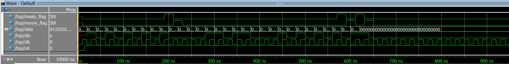

#### 2-16.3 图示：

###### `mealy` 模块


###### `moore` 模块


